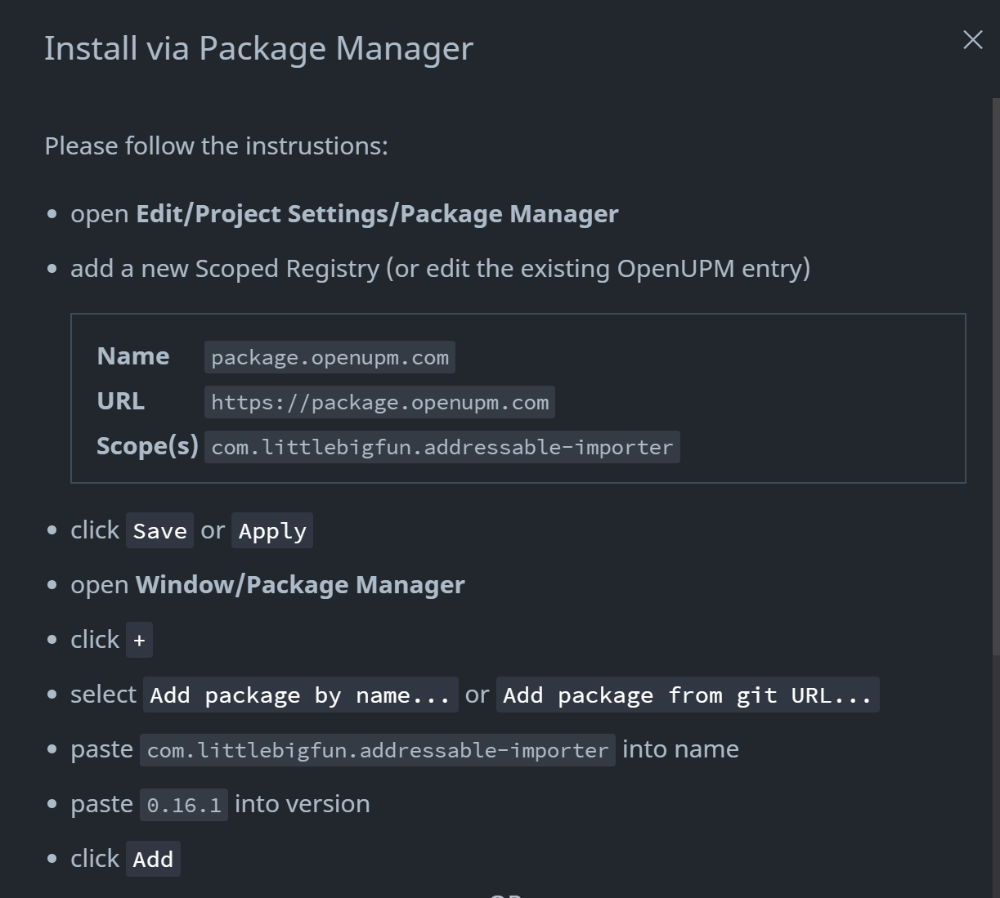
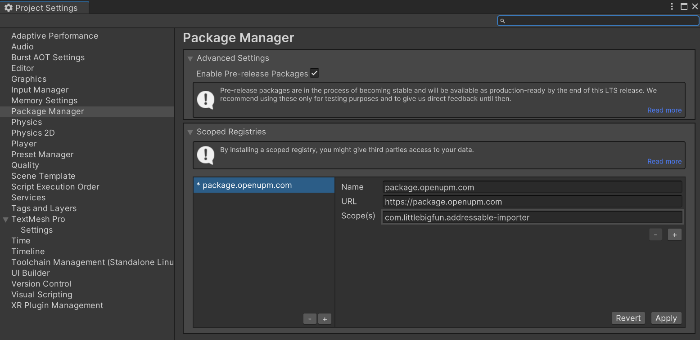
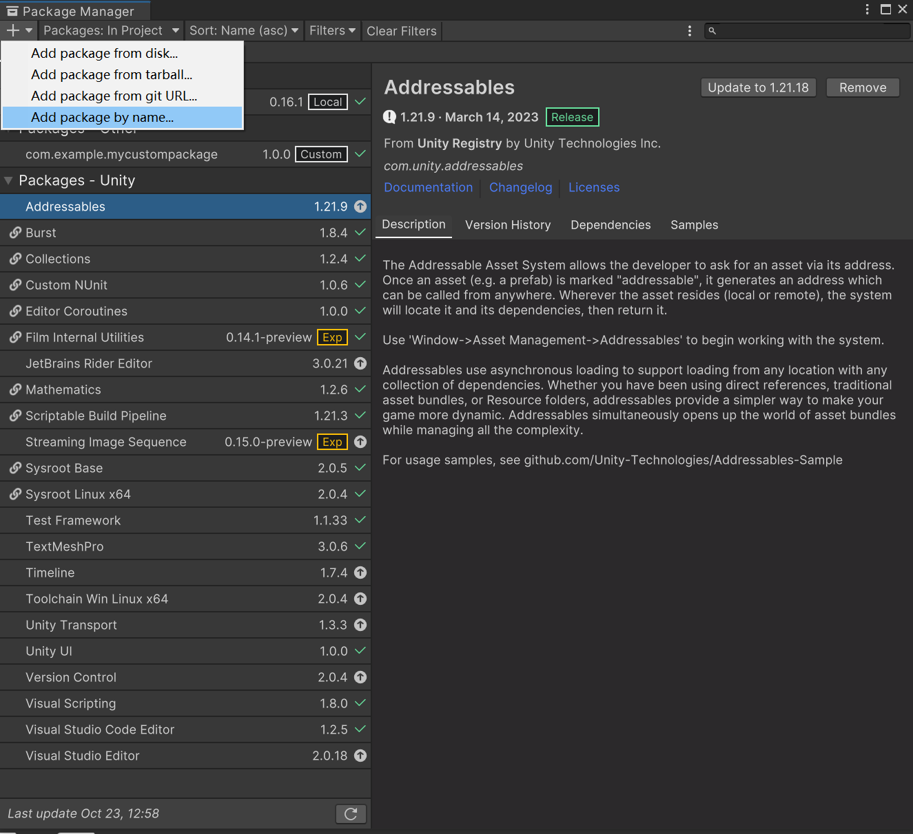

---
---
# Getting Started with Unity Editor

This article is a step-by-step tutorial on how to use OpenUPM with Unity Editor.

## Setup the Scoped Registry

Start by visiting [OpenUPM](https://openupm.com) and search for the package you want to install. For example, search for [Unity Addressable Importer](https://openupm.com/packages/com.littlebigfun.addressable-importer/), a helper package for managing addressable assets.


Click the **Manual installation** button to expand the installation instructions.



Following the instructions, open Unity Editor, and go to the menu `Edit/Project Settings`. Click on the `Package Manager` in the left panel.



Add a new scoped registry by clicking the **+** button. Input the following information provided in the instructions:

   - Name: `package.openupm.com`
   - URL: `https://package.openupm.com`
   - Scopes: `com.littlebigfun.addressable-importer`

Click the **Apply** button to add the scoped registry.

## Installing a UPM Package

Click the `Window/Packages` menu to open the Package Manager window. You should see the `Addressable Importer` package in the left panel list, where you can install it directly.

If it's not shown in the list, click the **+** button and select `Add package by name`.

   

Fill in the package name: `com.littlebigfun.addressable-importer` and version `0.16.1`. Click the **Add** button to install the package.

   

It's done! You can now use the package in your project.

## Understanding Manifest Changes

Behind the scenes, Unity records a few changes in the `Packages/manifest.json` file. It adds a scoped registry named `package.openupm.com` and includes the `com.littlebigfun.addressable-importer` package in the dependencies list.

```json
{
    "scopedRegistries": [
        {
            "name": "package.openupm.com",
            "url": "https://package.openupm.com",
            "scopes": [
                "com.littlebigfun.addressable-importer"
            ]
        }
    ],
    "dependencies": {
        "com.littlebigfun.addressable-importer": "0.16.1"
    }
}
```

If you find the process a bit verbose, you can learn more about the [openupm-cli](./getting-started-cli.md) to simplify the process.
